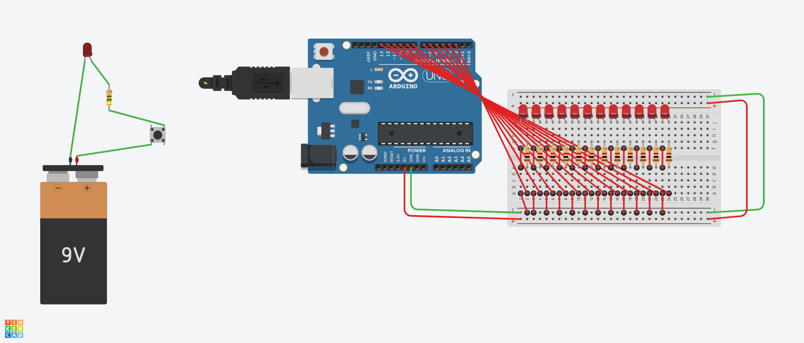

# Robotics & Artificial Intelligence Workshop


This repository documents my participation and practical project developed during the **Basics of Robotics and Artificial Intelligence** workshop (**أساسيات الروبوتات والذكاء الاصطناعي**).

The workshop introduced participants to fundamental concepts in **robotics, electronics, Arduino programming, circuit design, simulation, and artificial intelligence** through hands-on practical activities.

---

## 🏫 About the Workshop

The workshop was held at the **Madinty – Dhahrat Laban Office (مكتب مدينتي ظهرة لبن)** in Riyadh, Saudi Arabia.
It was conducted in cooperation with the organizations shown in the official workshop announcement, including **Riyadh Municipality** and **Ministry of Communications and Information Technology**.
The workshop focused on giving participants practical exposure to emerging technologies and allowing them to experiment with robotics and electronics using simulation and programming.

### Workshop Details

|                |                                                |
| -------------- | ---------------------------------------------- |
| **Workshop**   | Basics of Robotics and Artificial Intelligence |
| **Arabic**     | أساسيات الروبوتات والذكاء الاصطناعي            |
| **Location**   | Madinty – Dhahrat Laban, Riyadh                |
| **Date**       | August 18, 2026                             |
| **Platform**   | In person + Autodesk Tinkercad Circuits                    |
| **Technology** | Arduino                                        |

---

# 💡 My Project

As part of the practical activities, I developed an **Arduino-based Morse Code Flasher** using **13 LEDs** connected to digital pins **1 through 13**.

The project converts the text message:

```text
Mohammed
```

into **Morse code** and uses the LEDs to visually flash the encoded message.

All 13 LEDs operate together, creating a synchronized visual representation of the Morse code.

---

## ⚙️ How It Works

The program contains Morse code patterns for:

* Letters **A–Z**
* Numbers **0–9**
* Spaces between words

The message is processed character by character.
For each character, the program looks up its corresponding Morse code pattern and flashes all LEDs according to the Morse timing rules.

### Morse Timing
The timing follows the standard Morse-code structure:

| Signal              | Duration |
| ------------------- | -------: |
| Dot `.`             |   1 unit |
| Dash `-`            |  3 units |
| Gap between symbols |   1 unit |
| Gap between letters |  3 units |
| Gap between words   |  7 units |

---

## 🔌 Hardware / Circuit
Each LED is configured as an output and the program controls all LEDs simultaneously.



---

## 💻 Code

The main Arduino program is available here:

[`morse_code_flasher.ino`](morse_code_flasher.ino)

The program:

1. Initializes all 13 LED pins.
2. Reads the message `"Mohammed"`.
3. Converts lowercase characters to uppercase.
4. Finds the corresponding Morse code.
5. Flashes the LEDs for each dot and dash.
6. Adds the appropriate gaps between symbols and letters.
7. Stops after the complete message has been displayed.

---
## 🧠 What I Practiced

Through this project, I practiced:

* Arduino programming
* C/C++ programming fundamentals
* Digital output control
* Working with multiple LEDs
* Arrays and loops
* Functions and modular programming
* Character and string processing
* Morse code encoding
* Timing and delays
* Circuit simulation
* Basic electronics
* Debugging and testing

---
Thats it, thank you Alarena and Madinty and **Ministry of Communications and Information Technology**.
